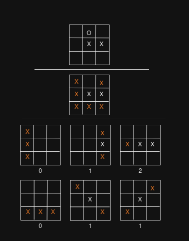

# tic-tac-toe

<video width="320" height="240" controls>
  <source src="assets/output.mov" type="video/mp4">
</video>

## Alpha-Beta pruning 

[Alpha–beta
pruning](https://en.wikipedia.org/wiki/Alpha%E2%80%93beta_pruning).

## Minimax

If current position is wins or lose to a player. Return `inf/-inf`
accordingly.

Otherwise, try all possible moves from center of the board. If AI can
win with a move, take that move immediately. If in 5 moves, we find a
way for human to win with a fork attack, we have to prevent it.
Therefore we have to check terminal state with 5 level deep. If we
ensure we will not lose in 5 moves, use `heuristic` function to
consider next move to save time.

## Heuristic evaluation

Find all possible wins from current position by assuming we will
occupy the remaining empty cells. From those winning states, count how
many cell we had set.

Do the same for opponent and subtract to get heuristic value.

## Game state optimization

Instead of using 2D list. We use single list as rows of the board and
manage column using bitwise operators. We can use single number and go
full bitwise but with 9x9 board, it will be 81 bits. Even though
python can expand variable bits for us. I just don't like it.

# Windows

Windows user must install `windows-curses`. 

## Disclaimer

Clicking is supported but might not work properly on Windows . And I
don't care.
